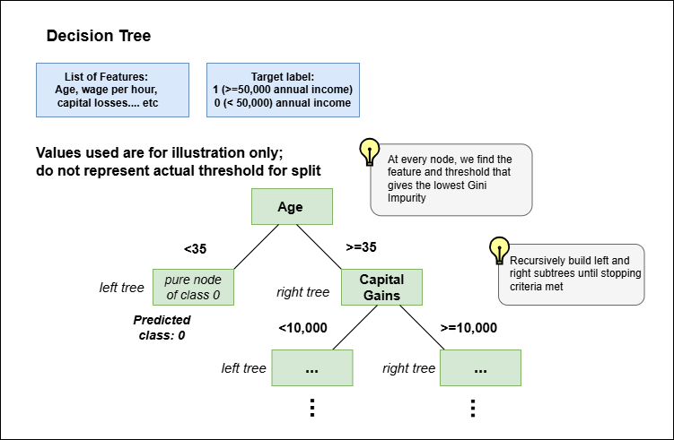

## Code Random Forest from scratch using Numpy

### <b>1. Overview:</b>
In this repo, I coded a Random Forest (RF) Model from scratch (using only NUMPY), achieving an 88% accuracy on UCI Census Income Dataset.  

The goal is to use this RF Model to predict whether an individual's annual income is >=50,000. This makes it a binary classification problem, with two labels: 0, if an individual income is <50,000, and 1, if an individual's income is >=50,000. 

### <b>2. Directory Structure:</b>

```
RF_FROM_SCRATCH
│   .gitignore
│   model_train_eval.ipynb
│   README.md
│   requirements.txt
│
├───assets
│       decision_tree.png
│
├───data
│       data.csv
│
└───src
        datapipeline.py
        decision_tree.py
        random_forest.py
        __init__.py
```
The diagram above shows the directory structure of this repo. 
The model files are located in src as decision_tree.py and random_forest.py.
src/datapipeline.py is a data cleaning pipeline that process the data and does train test split. 

Typically, we do not upload our data files on git repo, but for the purposes of replication and demonstration of the working model, I have included the data set I used from UCI machine learning repository into the data/ folder. 

The file that is important if you would like to see me put the coded RF to use is
model_train_eval.ipynb, located in root. 

### <b>3. Coding the Model:</b>

Random Forest is a multitude of Decision Trees. So, to build a Random Forest, we
need to first code a Decision Tree. 

#### <b>3.1 Decision Tree:</b>



My decision tree classifier was built from scratch using Python and Numpy. It recursively splits the dataset based on feature thresholds that minimize Gini impurity, creating nodes that store feature indices, thresholds, and class labels. The tree grows until a stopping criterion (max depth or pure nodes) is met. The ```fit``` method selects the best splits, while the ```predict``` method traverses the tree to classify new data based on learned splits. My model uses a majority class rule when no further splitting improves impurity reduction.

#### <b>3.2 Random Forest:</b>

To create a Random Forest, we need to define the number of Decision Trees in the forest. I draw samples from the X_train set using bootstrap aggregation (just a fancy term for sampling with replacement, also called bagging); I also sample features from the X_train set. How many times do I draw? As many times as the number of trees in my random forest. <br>
Model training happens by fitting Decision Trees to each sample data. <br>
For inferencing, (we use the X_test data now) we use a simple averaging mechanism, where the "votes" are averaged across the trees for each data point (an entry of X_test).

### <b>4. Evaluation</b>

I evaluated the Decision Tree and Random Forest Models in the notebook:
model_train_eval.ipynb. 

Decision Tree: Accuracy - 82%
Random Forest: Accuracy - <b>88%</b>

### <b>5. Replication</b>

To replicate my experiment, do the following: <br>

```$ git clone <repository_url>```

Create a new virtual environment; 
activate it. I used python 3.9 for this project. <br>

```$ conda create --name <env_name> python=3.9```

```$ conda activate <env_name>```

Then install the required dependencies:
```$ pip install -r requirements.text```